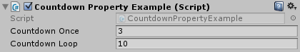

# Countdown

This class is useful for things like cooldowns or spawn delays. It is also helpful for tweening things by using the `PercentElapsed` property.

(If you want to tween a lot of stuff, you might want to check out [DOTween](http://dotween.demigiant.com). Actually, check it out either way, DOTween is fabulous!)

## Examples

### CountdownExample

```C#
public class CountdownExample : MonoBehaviour
{
	Countdown countdownLoop;
	Countdown countdownRandom;
	Countdown countdownOnce;
	Countdown countdownDelay;

	void Awake()
	{
		// Looping countdown, every 2 seconds
		countdownLoop = new Countdown(true, 2f);

		// Looping countdown, delegate is called every loop to determine duration (1 to 5 seconds)
		countdownRandom = new Countdown(true, () => UnityEngine.Random.Range(1f, 5f));

		// Non-looping countdown, 5 seconds duration. Can be reset by calling Reset().
		countdownOnce = new Countdown(false, 5f);

		// Non-looping countdown that isn't started yet. Can be started by calling e.g. Reset(5f).
		countdownDelay = new Countdown(false);
	}

	void Update()
	{
		// Looping automatically
		if (countdownLoop.Progress())
			Debug.Log("This is logged every 2 seconds.");

		// Looping automatically. Duration is chosen between 1 and 5 every loop.
		if (countdownRandom.Progress())
			Debug.Log("This is logged every 1 to 5 seconds.");

		// Not looping
		if (countdownOnce.Progress())
			Debug.Log("This is shown once after 5 seconds.");

		// Start countdownDelay (again) - if it's already running, it is reset
		if (Input.GetKeyDown(KeyCode.Alpha1))
			countdownDelay.Reset(1f); // 1 second

		if (Input.GetKeyDown(KeyCode.Alpha2))
			countdownDelay.Reset(2f); // 2 seconds

		// Show this once 1/2 seconds after 1/2 was last pressed
		if (countdownDelay.Progress())
			Debug.Log("This is shown after " + countdownDelay.Duration + " seconds.");

		// Output data about the countdown when space is pressed
		if (Input.GetKeyDown(KeyCode.Space))
		{
			if (countdownDelay.IsRunning)
				Debug.Log("countdownDelay is " + (countdownDelay.PercentElapsed * 100) + "% complete.");
			else
				Debug.Log("countdownDelay is stopped.");
		}
	}
```

### CountdownPropertyExample

You can also use `CountdownPropertyOnce` and `CountdownPropertyLoop` to get the values directly from the
editor. Live-editing works - if you change the value in the editor, it will be used in the next loop.



```C#
public class CountdownPropertyExample : MonoBehaviour
{
	[SerializeField] CountdownPropertyOnce countdownOnce;
	[SerializeField] CountdownPropertyLoop countdownLoop;

	void Update()
	{
		// Looping automatically
		if (countdownLoop.Progress())
			Debug.Log("This is logged every " + countdownLoop.Duration + " seconds.");

		// Not looping
		if (countdownOnce.Progress())
			Debug.Log("This is shown once after " + countdownOnce.Duration + " seconds.");

		// Start countdownOnce again - if it's already running, it is reset
		if (Input.GetKeyDown(KeyCode.Space))
			countdownOnce.Reset();
	}
}
```

## Dependencies

None.