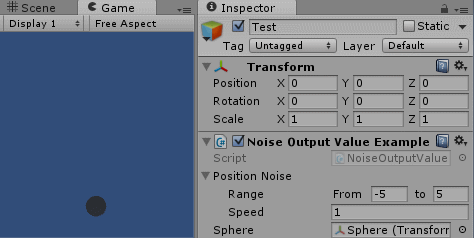

# NoiseOutputValue

Changes an output value in an editable range over time with an editable speed using [Perlin Noise](http://docs.unity3d.com/ScriptReference/Mathf.PerlinNoise.html).

## Example



```C#
public class NoiseOutputValueExample : MonoBehaviour
{
	[SerializeField] NoiseOutputValue positionNoise;
	[SerializeField] Transform sphere;

	private void Update()
	{
		// Updates the value with Time.deltaTime*speed
		positionNoise.Update();

		// Sets the y position at the current output value
		sphere.transform.position = new Vector3(0, positionNoise.OutputValue, 0f);
	}
}
```

## Dependencies

* [Range](https://github.com/TobiasWehrum/unity-utilities/tree/master/Range)